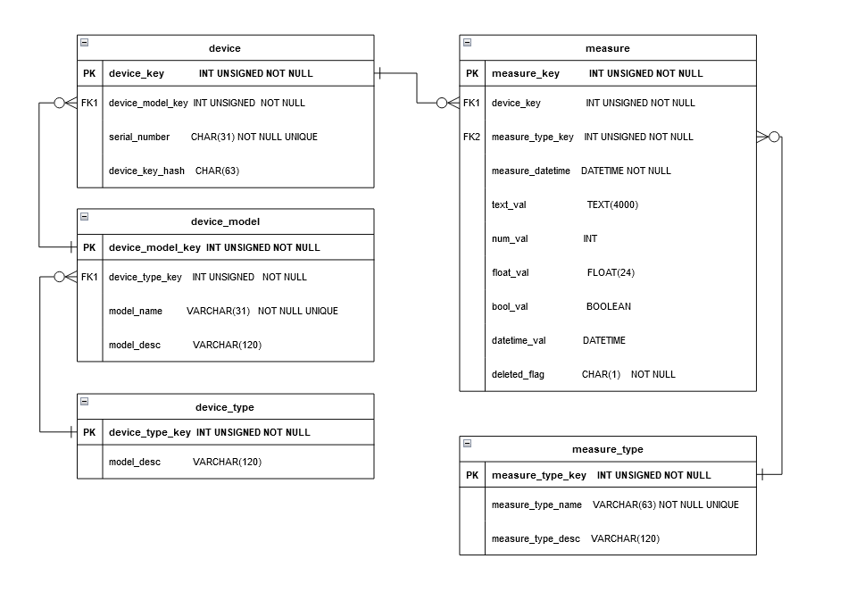
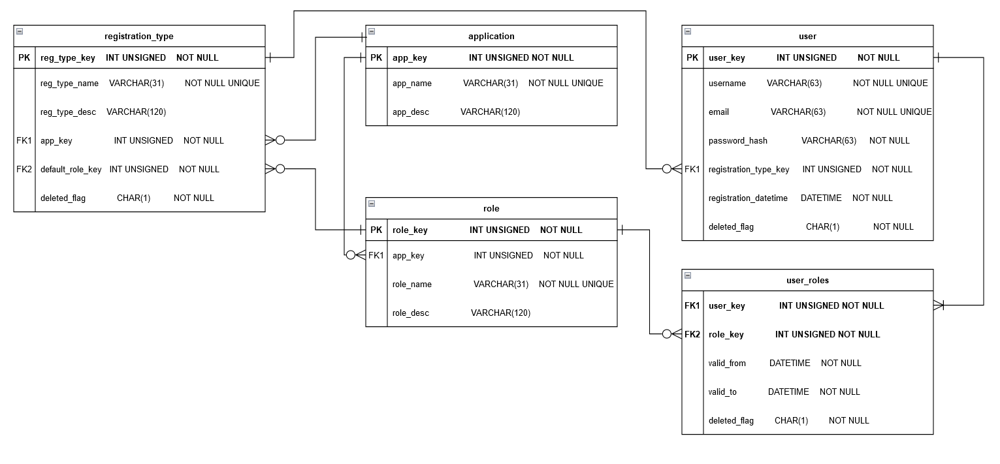
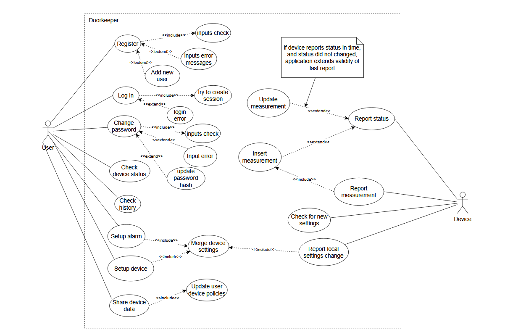
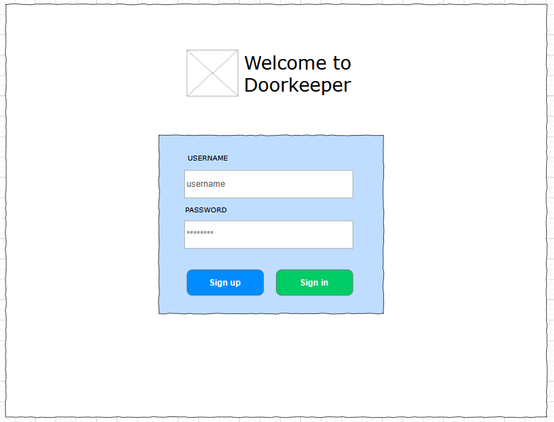
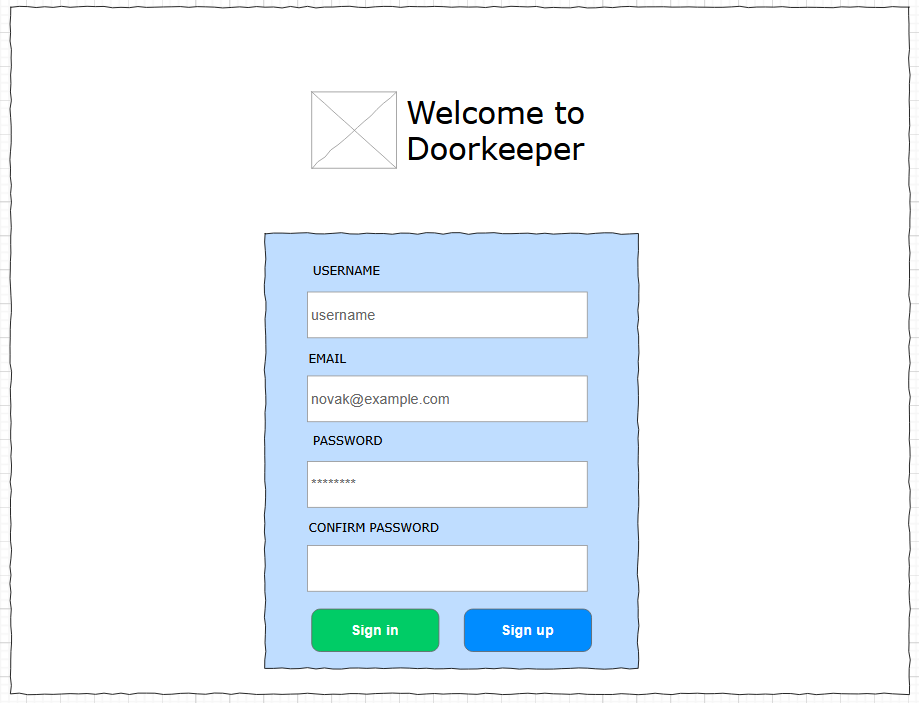
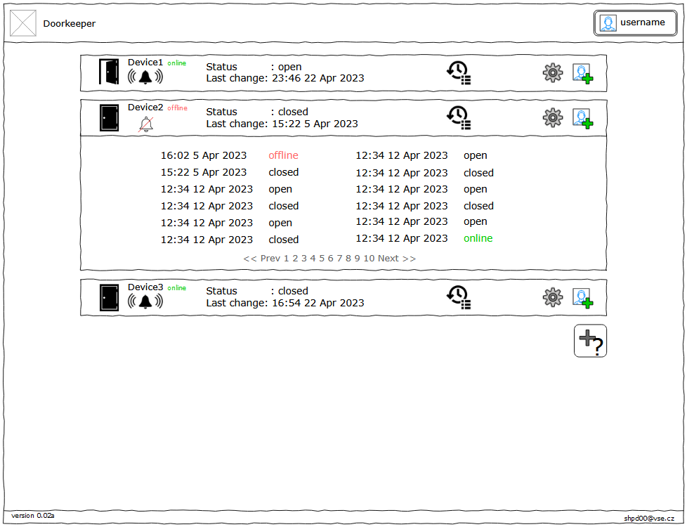

# IoT devices management system

The system consists of IoT devices with internet access, a server with a database of devices and their measurements, a database of application users, and the web application for viewing device status and history.

## IoT device

For the needs of my semester work, I will be using a self-made IoT device based on an ESP12 chip with a door opening sensor. This device will use POST request to report its status regularly and also send data when the state of the sensor changes.

The device settings include connection to the local WiFi network, local time zone, username of the device owner.
Those settings would be made using the device's access point and its own web page, but I will leave the development of this logic out of the scope of the project.

## Backend

IoT devices can be used in many areas and the potential use of the system can vary greatly between users of different devices. Therefore, the database needs to support a larger number of applications for different purposes. For example, one application may be designed to manage an ecosystem in a greenhouse, while another may be designed to manage a smart home.

__The backend will include 3 databases :__
- database of devices and their data
- database of applications and their users
- a separate database with processes to manipulate the data in two main databases

A third database will help to secure data and data consistency and to separate application logic from data storage logic. 
For each action in applications such as:
- register a user
- check the availability of an email or username to register
- enter a device measurement into the table

,separate procedures will be created. The web server will not have direct access to data.

### Data models

Devices database

Users database

## Frontend

To determine the requirements for the frontend, we need to consider what it will be used for.
In the case of door sensor management app, the user needs to :
- Register to the app
- Log in to the app
- Be able to change the password.
- See a list of available devices
- See the status of the device (online/offline, door open/closed)
- See device status history
- Be able to change device settings remotely (like frequency of regular device reports)
- Allow another user to see device data
- Enable push notifications when device status changes

Application content needs to be dynammicly updated as reacts on device status change. For dynamic uploading of data it is suitable to use Javascript.

### Use-case diagram

### Pages

The application will consist of a home page with login and registration options, a password change page, and an application page. The application pages will display either a list of devices and their status, or a detailed data display of the selected device. 
It should be possible to configure the device from the device page, or from the devices list page, or both.
### Wire diagrams

Login page

Registration form

Application main

